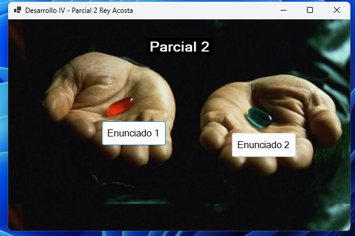
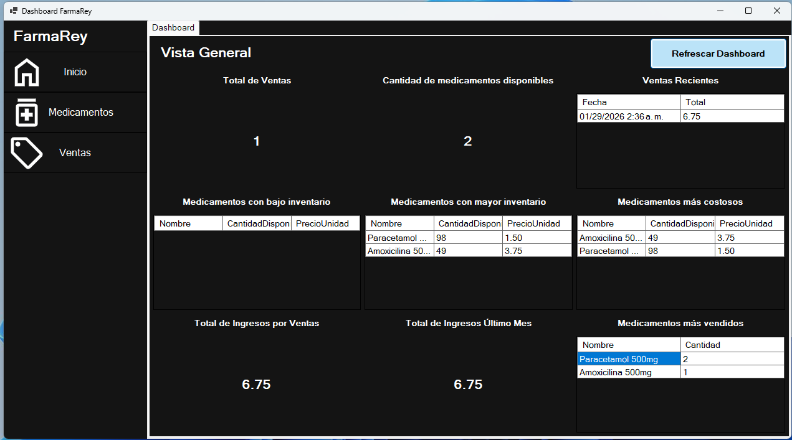
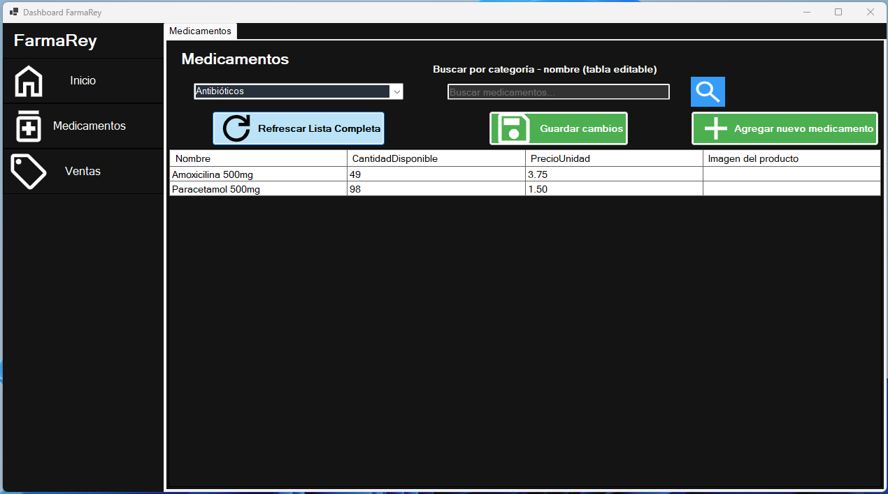
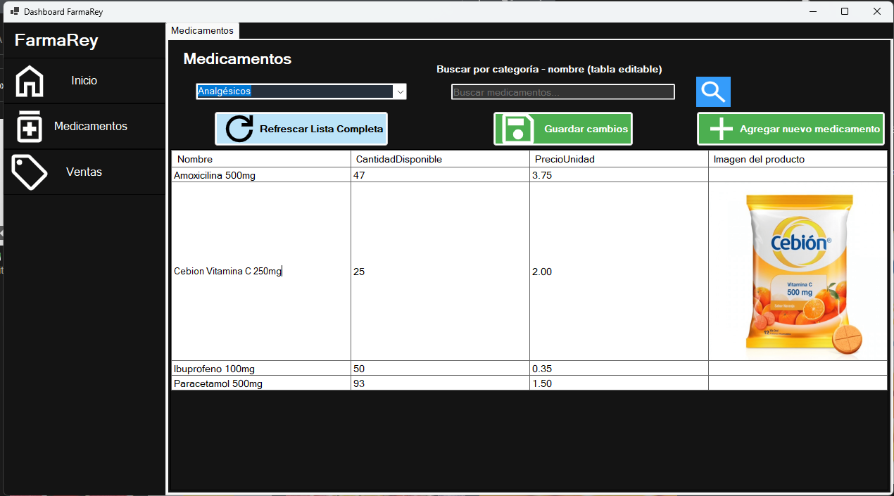
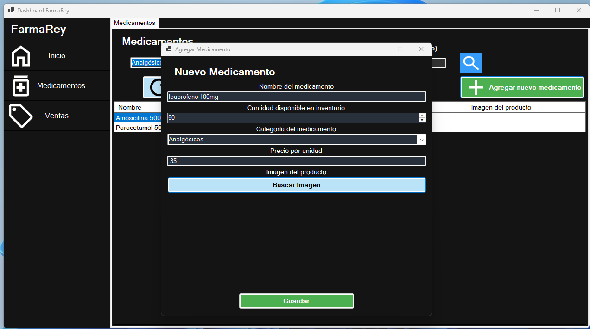
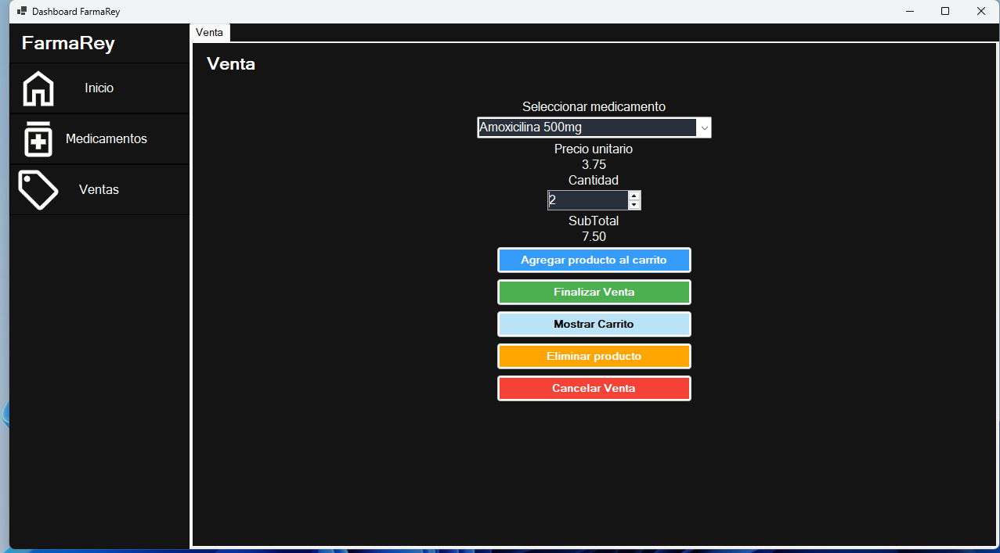
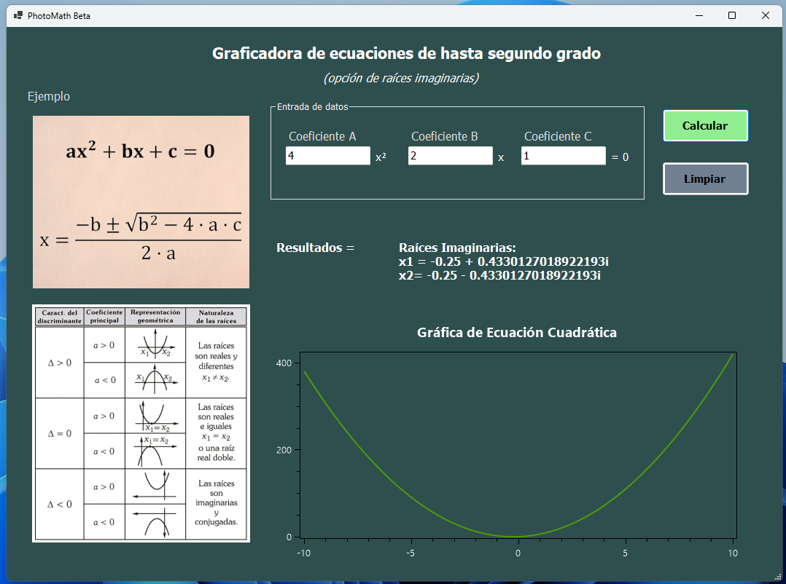

# Punto de ventas Farmacia - Dashboard

Dashboard funcional construido con [Windows Forms](https://en.wikipedia.org/wiki/Windows_Forms) C# y [EF PostgreSQL](https://www.npgsql.org/efcore/?tabs=onconfiguring)

## Capturas



**Ejercicio 1 - Dashboard**











**Ejercicio 2 - Gráfica funciones matemáticas**




### Pasos para usar

Requisitos:

1. Visual Studio en Windows
2. Docker

Pasos:

1. Abrir el proyecto después de clonarse
2. Ejecutar la base de datos PostgreSQL usando docker

```bash
docker compose up -d
```

3. Ejecutar la aplicación con ayuda de Visual Studio 
